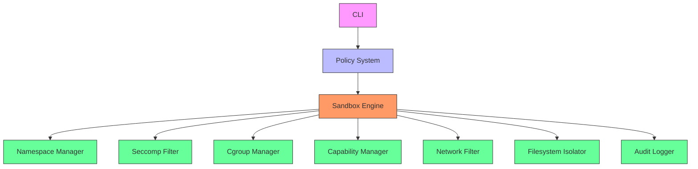
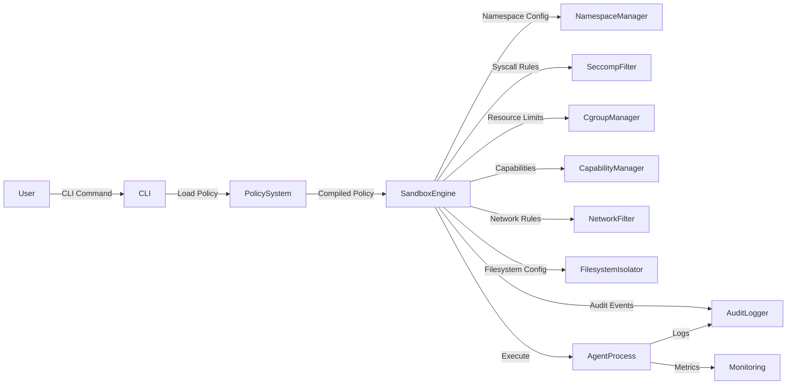
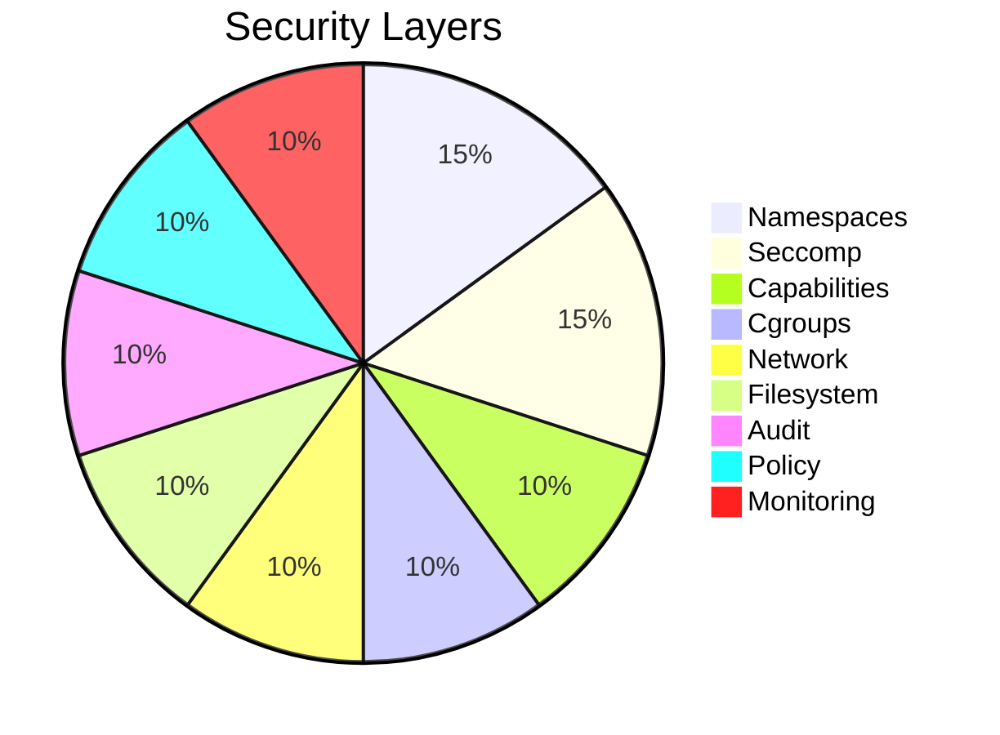
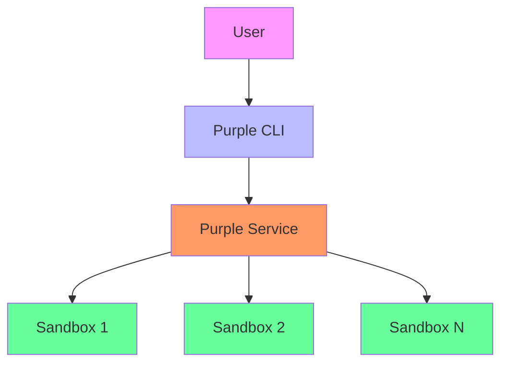
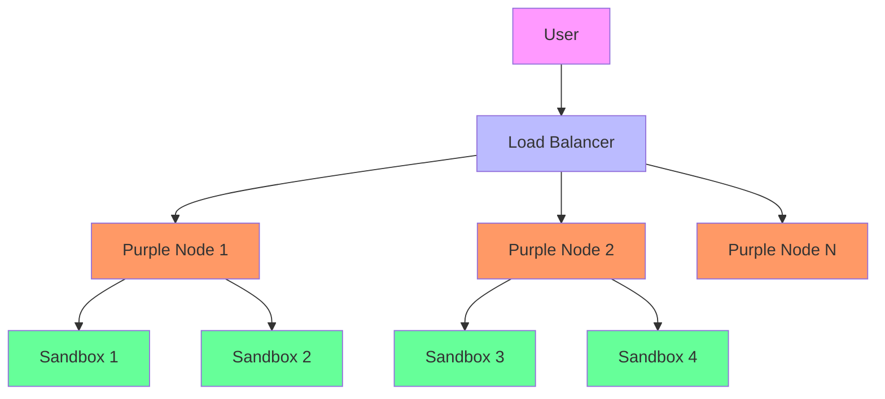
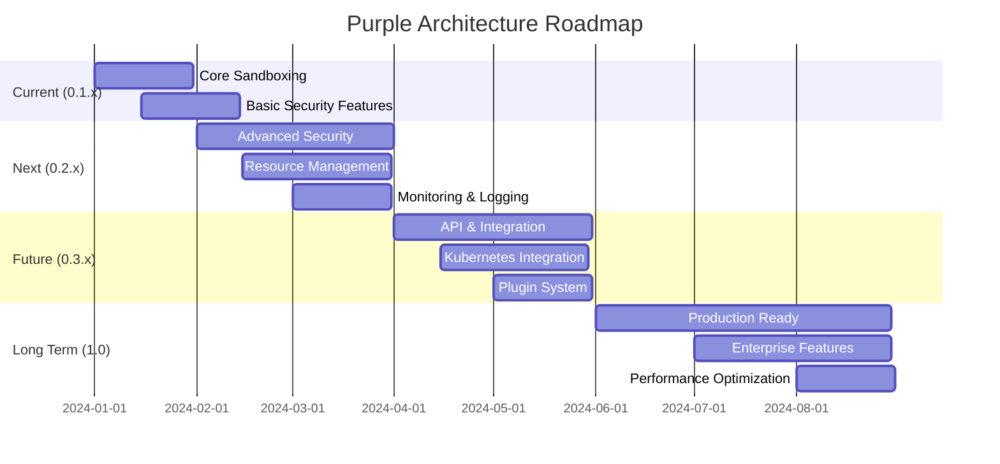

# Architecture Overview

## High-Level Architecture

## Component Architecture

### 1. CLI Interface

The Command Line Interface provides user interaction with the sandbox system.

**Responsibilities:**
- Parse command line arguments
- Validate user input
- Display help and usage information
- Manage logging levels
- Coordinate with other components

**Key Features:**
- Profile management (create, list, show, delete)
- Sandbox execution with policy selection
- Logging level control (-l flag)
- Help system and documentation

### 2. Policy System

The Policy System handles security policy definition, validation, and compilation.

**Responsibilities:**
- Load YAML policy files
- Validate policy structure and rules
- Compile policies into executable form
- Provide policy information to other components

**Key Features:**
- YAML-based declarative policies
- Policy validation and error reporting
- Policy compilation with defaults
- Policy caching and management

### 3. Sandbox Engine

The core component that orchestrates the sandbox execution.

**Responsibilities:**
- Coordinate all security components
- Manage sandbox lifecycle
- Handle errors and cleanup
- Provide execution environment

**Key Features:**
- 8-step execution pipeline
- Error handling and recovery
- Resource management
- Process isolation

### 4. Security Components

#### Namespace Manager
- **Purpose**: Linux namespace isolation
- **Namespaces**: User, PID, Mount, Network
- **Features**: Unshare, configuration, cleanup

#### Seccomp Filter
- **Purpose**: Syscall filtering
- **Features**: 450+ syscall mappings
- **Policy**: Default-deny with allowlist

#### Cgroup Manager
- **Purpose**: Resource limits
- **Resources**: CPU, Memory, PIDs, I/O
- **Features**: Hierarchical limits, monitoring

#### Capability Manager
- **Purpose**: Privilege management
- **Policy**: Default-drop with addlist
- **Features**: Least privilege enforcement

#### Network Filter
- **Purpose**: Network isolation
- **Features**: Port filtering, firewall rules
- **Policy**: Complete isolation or selective filtering

#### Filesystem Isolator
- **Purpose**: Filesystem security
- **Features**: Bind mounts, chroot, permissions
- **Policy**: Read-only, writable, output directories

#### Audit Logger
- **Purpose**: Security monitoring
- **Features**: Comprehensive logging, audit trails
- **Policy**: Configurable detail levels

## Data Flow

## Security Architecture

### Defense in Depth

### Isolation Levels

1. **Process Isolation**: Separate PID namespace
2. **User Isolation**: Separate user namespace
3. **Filesystem Isolation**: Chroot and bind mounts
4. **Network Isolation**: Separate network namespace
5. **Syscall Isolation**: Seccomp filtering
6. **Privilege Isolation**: Capability dropping
7. **Resource Isolation**: Cgroups limits

## Performance Considerations

### Overhead Analysis

| Component | Overhead | Impact |
|-----------|----------|--------|
| Namespaces | Low | Native kernel feature |
| Seccomp | Medium | Syscall filtering |
| Cgroups | Low | Minimal impact |
| Chroot | Very Low | Filesystem isolation |
| Logging | Configurable | Adjust levels |

### Optimization Strategies

1. **Minimize Allowed Syscalls**: Reduce seccomp overhead
2. **Use Appropriate Log Levels**: Production: error/warn, Development: debug/trace
3. **Set Reasonable Resource Limits**: Balance security and performance
4. **Leverage Kernel Features**: Use native isolation mechanisms

## Deployment Architecture

### Single Node Deployment

### Distributed Deployment

## Future Architecture Evolution

### Planned Enhancements

1. **Microservices Architecture**: Separate components as services
2. **API Gateway**: REST API for remote management
3. **Kubernetes Operator**: Native Kubernetes integration
4. **Plugin System**: Extensible architecture
5. **Distributed Monitoring**: Centralized logging and metrics

### Roadmap

## Architecture Decision Records (ADRs)

### ADR-001: Default-Deny Security Model

**Status**: Accepted
**Date**: 2024-01-01

**Context**: Need to establish a security model for the sandbox

**Decision**: Adopt a default-deny security model where all operations are denied by default and explicitly allowed operations must be specified in the policy.

**Consequences**:
- ✅ Higher security by default
- ❌ More complex policy configuration
- ✅ Better alignment with security best practices

### ADR-002: YAML Policy Format

**Status**: Accepted
**Date**: 2024-01-05

**Context**: Need to choose a configuration format for security policies

**Decision**: Use YAML for policy configuration due to its human-readable nature and widespread adoption in the security community.

**Consequences**:
- ✅ Easy to read and write
- ✅ Good tooling support
- ❌ Potential for configuration errors
- ✅ Supports complex nested structures

### ADR-003: Modular Security Components

**Status**: Accepted
**Date**: 2024-01-10

**Context**: Need to design the internal security architecture

**Decision**: Implement security as modular components (namespaces, seccomp, cgroups, etc.) that can be independently configured and updated.

**Consequences**:
- ✅ Flexible architecture
- ✅ Easier maintenance
- ✅ Better testability
- ❌ More complex coordination

## Conclusion

The Purple architecture provides a comprehensive, secure, and flexible foundation for AI agent sandboxing. The modular design allows for independent evolution of components while maintaining strong security guarantees through defense-in-depth principles.